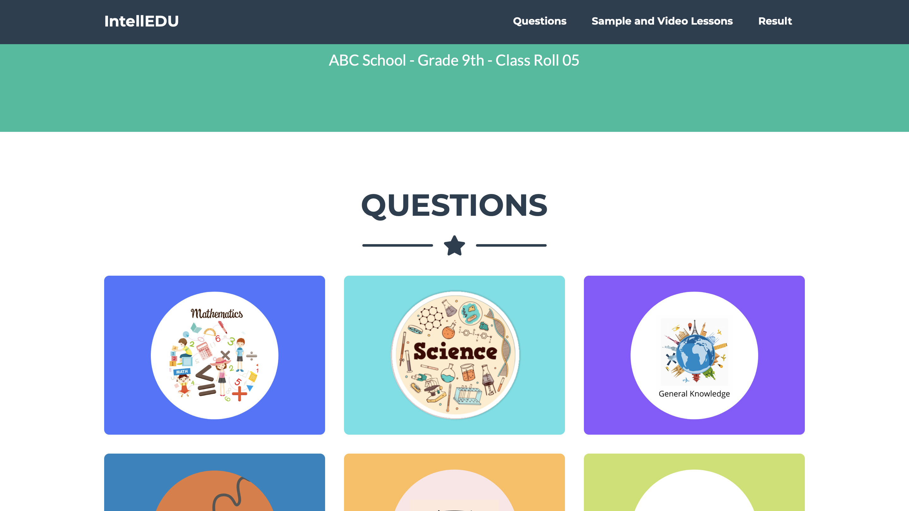
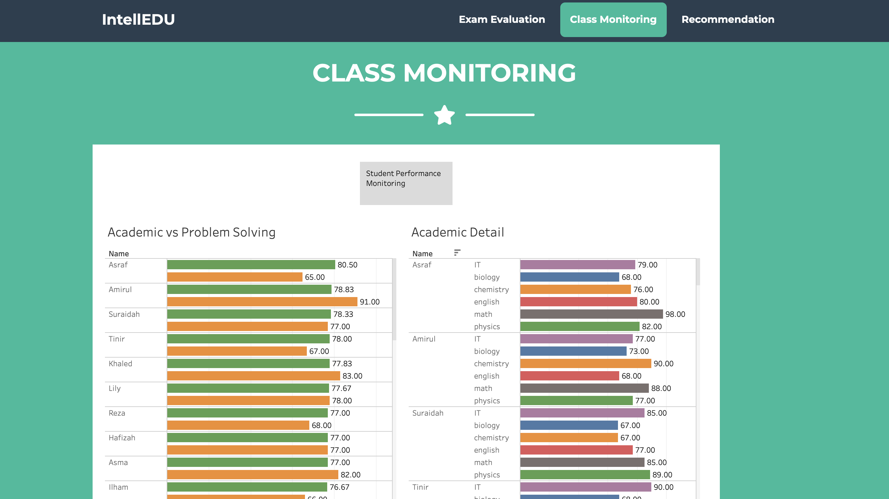

## IntellEdu
IntellEdu is an intelligent system for college student to recommend which career path they should decide (IT, Doctor, Engineer) based on their
academic, IQ and Co-Curriculum performance. 

## Live Demo
https://sheikhhanif.github.io/IntellEdu/
## Student Panel

## Teacher Panel

## Acknowledgement 
This project is developed by 5 of us
- Sheikh Hanif
- Noman Alahi
- Abid Utsa
- Ahmad
- Nafess
